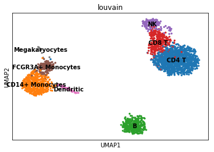
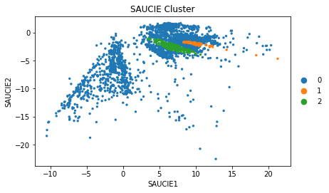
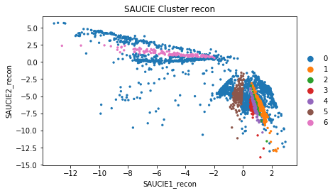
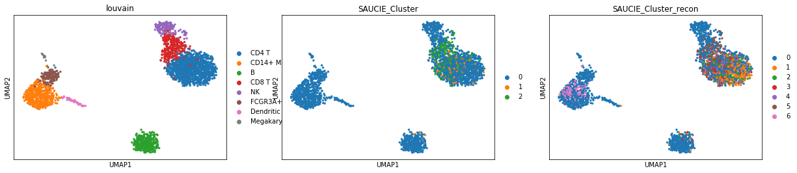

## SAUCIE Journal Club
  - [Reference](https://www.krishnaswamylab.org/projects/saucie/)
  - [Biorxiv](https://www.biorxiv.org/content/biorxiv/early/2019/01/03/237065.full.pdf)

**Exploring Single-Cell Data with Deep Multitasking Neural Networks**

Preivew of the paper on biorxiv.


### Description

Our unsupervised architecture, called SAUCIE (Sparse Autoencoder for Unsupervised Clustering, Imputation, and Embedding), simultaneously performs several key tasks for single-cell data analysis including 1) clustering, 2) batch correction, 3) visualization, and 4) denoising/imputation. SAUCIE is trained to recreate its own input after reducing its dimensionality in a 2-D embedding layer which can be used to visualize the data. 

Additionally, SAUCIE uses two novel regularizations: (1) an information dimension regularization to penalize entropy as computed on normalized activation values of the layer, and thereby encourage binary-like encodings that are amenable to clustering and (2) a Maximal Mean Discrepancy penalty to correct batch effects. Thus SAUCIE has a single architecture that denoises, batch-corrects, visualizes and clusters data using a unified representation. We show results on artificial data where ground truth is known, as well as mass cytometry data from dengue patients, and single-cell RNA-sequencing data from embryonic mouse brain.

#### Architecture

SAUCIE consists of three encoding layers, an embedding layer, and then three decoding layers.

#### Training

To perform multiple tasks, SAUCIE uses a single architecture as described above, but is run
and optimized sequentially. The first run imputes noisy values and corrects batch effects in the
original data. This preprocessed data is then run through SAUCIE again to obtain a visualization
and to pick out clusters.

The loss function of all runs starts with a reconstruction loss Lr forcing the autoencoder to
learn to reconstruct its input at the end. SAUCIE uses the standard mean-squared error loss (i.e.,

$$L_{r}(X, \hat{X}) = \frac{1}{n}\Sigma^{n}_{i=1}||x_i − \hat{x_{i}}||^2$$


### Four key tasks:

  1. visualization and dimensionality reduction,
  2. batch correction,
  3. clustering, and
  4. denoising and imputation.


  #### Visualization/Dimensionality Reduction

2-D bottleneck used as embeddings for visualization.  

This regularization is computed from the visualization layer to ensure consistency across subsampled batches. The resulting total loss is then,
$$ L = L_r(X, \hat{X}) + \lambda_b · L_b(V )$$

#### Batch Correction
(page13-14, 22 and 26-27)


The batch correction term $L_b$ calculates the Maximal Mean Discrepancy (MMD) between batches, as

$$L_b = \Sigma_{i\neq{ref}}MMD(V_{ref} , V_i),$$

where $V_{ref}$ is the visualization layer of one of the replicates, arbitrarily chosen to be considered as a reference batch

#### Clustering
(page 27)

The loss function of the clustering run then optimizes $L_r$ along with two regularization terms $L_c$ and $L_d$ that together enable SAUCIE to learn clusters:

$$L = L_r(\hat{X}, \tilde{X}) + \lambda_c · L_c(B) + \lambda_d · L_d(B, \hat{X})$$


The two regularizations $\lambda_d$ and $\lambda_c$ affect the number of clusters that result. For a given value
of $\lambda_d$, as $\lambda_c$ increases, the number of clusters decreases (coarser granularity). Higher values of $\lambda_d$ yield more clusters (finer granularity). Notably, these results are robust and yield reasonable
results for varying values of the two regularizations.


#### Denoising/Imputation

### Download Code

There is not packages to install.  It is tensorflow code that is on the github page for the lab.  You are able to download a zip file of the repository and save it to a directory called code.  We will reference this for the functions to run SAUCIE.


```python
## Get code from github and download to code directory
!mkdir code
!wget https://github.com/KrishnaswamyLab/SAUCIE/archive/master.zip -O code/master.zip
!cd code; unzip master.zip
!cd ..
```

    --2019-02-16 10:45:16--  https://github.com/KrishnaswamyLab/SAUCIE/archive/master.zip
    Resolving github.com... 192.30.253.113, 192.30.253.112
    Connecting to github.com|192.30.253.113|:443... connected.
    HTTP request sent, awaiting response... 302 Found
    Location: https://codeload.github.com/KrishnaswamyLab/SAUCIE/zip/master [following]
    --2019-02-16 10:45:16--  https://codeload.github.com/KrishnaswamyLab/SAUCIE/zip/master
    Resolving codeload.github.com... 192.30.253.120, 192.30.253.121
    Connecting to codeload.github.com|192.30.253.120|:443... connected.
    HTTP request sent, awaiting response... 200 OK
    Length: unspecified [application/zip]
    Saving to: ‘code/master.zip’
    
    code/master.zip         [ <=>                ]  12.25K  --.-KB/s    in 0.02s   
    
    2019-02-16 10:45:16 (626 KB/s) - ‘code/master.zip’ saved [12541]
    
    Archive:  master.zip
    c2e59683ddf401f07d4c226a420b367181934715
       creating: SAUCIE-master/
      inflating: SAUCIE-master/.gitignore  
      inflating: SAUCIE-master/README.md  
      inflating: SAUCIE-master/SAUCIE.py  
     extracting: SAUCIE-master/__init__.py  
      inflating: SAUCIE-master/example.py  
      inflating: SAUCIE-master/loader.py  
      inflating: SAUCIE-master/model.py  
      inflating: SAUCIE-master/utils.py  


### Download 10x PBMC data

We will use the PBMC data from the 10x website as our test data.  You can download this and place it in a directory called data.  


```python
!mkdir data
!wget https://s3-us-west-2.amazonaws.com/10x.files/samples/cell/pbmc3k/pbmc3k_filtered_gene_bc_matrices.tar.gz -O data/pbmc3k_filtered_gene_bc_matrices.tar.gz
!cd data; tar -xzf pbmc3k_filtered_gene_bc_matrices.tar.gz
!cd ..
```

    --2019-02-16 10:45:19--  https://s3-us-west-2.amazonaws.com/10x.files/samples/cell/pbmc3k/pbmc3k_filtered_gene_bc_matrices.tar.gz
    Resolving s3-us-west-2.amazonaws.com... 52.218.209.8
    Connecting to s3-us-west-2.amazonaws.com|52.218.209.8|:443... connected.
    HTTP request sent, awaiting response... 200 OK
    Length: 7621991 (7.3M) [application/x-tar]
    Saving to: ‘data/pbmc3k_filtered_gene_bc_matrices.tar.gz’
    
    data/pbmc3k_filtere 100%[===================>]   7.27M  3.98MB/s    in 1.8s    
    
    2019-02-16 10:45:21 (3.98 MB/s) - ‘data/pbmc3k_filtered_gene_bc_matrices.tar.gz’ saved [7621991/7621991]
    


### Requirements

You will also need to have the following python modules installed to run this. 
```
## Python3
scanpy
louvain
tensorflow 1.4.0
numpy 1.13.3
scipy 1.1.0
```
**Note:** all requirements automatically satisfied in colab.research.google.com except for scanpy and louvain.  


```python
%%time
## this takes about 5 minutes
## installing scanpy and louvain
!pip install scanpy louvain tensorflow
```

    Requirement already satisfied: scanpy in /anaconda3/envs/scanpy/lib/python3.6/site-packages (1.4)
    Requirement already satisfied: louvain in /anaconda3/envs/scanpy/lib/python3.6/site-packages (0.6.1)
    Collecting tensorflow
    [?25l  Downloading https://files.pythonhosted.org/packages/81/07/be624c7e0a63b080a76b7f6faf417eecdc5f6480f6a740a8bcf8991bce0b/tensorflow-1.12.0-cp36-cp36m-macosx_10_11_x86_64.whl (62.0MB)
        100% |████████████████████████████████| 62.0MB 651kB/s eta 0:00:01
    [?25hRequirement already satisfied: anndata>=0.6.15 in /anaconda3/envs/scanpy/lib/python3.6/site-packages (from scanpy) (0.6.18)
    Requirement already satisfied: statsmodels in /anaconda3/envs/scanpy/lib/python3.6/site-packages (from scanpy) (0.9.0)
    Requirement already satisfied: seaborn in /anaconda3/envs/scanpy/lib/python3.6/site-packages (from scanpy) (0.9.0)
    Requirement already satisfied: patsy in /anaconda3/envs/scanpy/lib/python3.6/site-packages (from scanpy) (0.5.0)
    Requirement already satisfied: natsort in /anaconda3/envs/scanpy/lib/python3.6/site-packages (from scanpy) (5.4.0)
    Requirement already satisfied: networkx in /anaconda3/envs/scanpy/lib/python3.6/site-packages (from scanpy) (2.2)
    Requirement already satisfied: joblib in /anaconda3/envs/scanpy/lib/python3.6/site-packages (from scanpy) (0.13.1)
    Requirement already satisfied: scipy in /anaconda3/envs/scanpy/lib/python3.6/site-packages (from scanpy) (1.1.0)
    Requirement already satisfied: matplotlib>=2.2 in /anaconda3/envs/scanpy/lib/python3.6/site-packages (from scanpy) (3.0.0)
    Requirement already satisfied: scikit-learn>=0.19.1 in /anaconda3/envs/scanpy/lib/python3.6/site-packages (from scanpy) (0.20.2)
    Requirement already satisfied: pandas>=0.21 in /anaconda3/envs/scanpy/lib/python3.6/site-packages (from scanpy) (0.23.4)
    Requirement already satisfied: tables in /anaconda3/envs/scanpy/lib/python3.6/site-packages (from scanpy) (3.4.4)
    Requirement already satisfied: numba>=0.40.0 in /anaconda3/envs/scanpy/lib/python3.6/site-packages (from scanpy) (0.42.1)
    Requirement already satisfied: h5py in /anaconda3/envs/scanpy/lib/python3.6/site-packages (from scanpy) (2.8.0)
    Requirement already satisfied: python-igraph>=0.7.1.0 in /anaconda3/envs/scanpy/lib/python3.6/site-packages (from louvain) (0.7.1.post6)
    Collecting keras-applications>=1.0.6 (from tensorflow)
    [?25l  Downloading https://files.pythonhosted.org/packages/90/85/64c82949765cfb246bbdaf5aca2d55f400f792655927a017710a78445def/Keras_Applications-1.0.7-py2.py3-none-any.whl (51kB)
        100% |████████████████████████████████| 61kB 4.6MB/s ta 0:00:01
    [?25hCollecting protobuf>=3.6.1 (from tensorflow)
    [?25l  Downloading https://files.pythonhosted.org/packages/c7/27/133f225035b9539f2dcfebcdf9a69ff0152f56e0120160ec5c972ea7deb9/protobuf-3.6.1-cp36-cp36m-macosx_10_6_intel.macosx_10_9_intel.macosx_10_9_x86_64.macosx_10_10_intel.macosx_10_10_x86_64.whl (1.2MB)
        100% |████████████████████████████████| 1.2MB 8.3MB/s eta 0:00:01
    [?25hCollecting grpcio>=1.8.6 (from tensorflow)
    [?25l  Downloading https://files.pythonhosted.org/packages/50/11/e1a1e4912131c783f01734597150a58d75003d89aeff3ebf3d2ee5b4d36a/grpcio-1.18.0-cp36-cp36m-macosx_10_9_x86_64.whl (1.8MB)
        100% |████████████████████████████████| 1.8MB 7.3MB/s eta 0:00:01
    [?25hRequirement already satisfied: wheel>=0.26 in /anaconda3/envs/scanpy/lib/python3.6/site-packages (from tensorflow) (0.32.0)
    Collecting astor>=0.6.0 (from tensorflow)
      Downloading https://files.pythonhosted.org/packages/35/6b/11530768cac581a12952a2aad00e1526b89d242d0b9f59534ef6e6a1752f/astor-0.7.1-py2.py3-none-any.whl
    Collecting gast>=0.2.0 (from tensorflow)
      Downloading https://files.pythonhosted.org/packages/4e/35/11749bf99b2d4e3cceb4d55ca22590b0d7c2c62b9de38ac4a4a7f4687421/gast-0.2.2.tar.gz
    Collecting termcolor>=1.1.0 (from tensorflow)
      Downloading https://files.pythonhosted.org/packages/8a/48/a76be51647d0eb9f10e2a4511bf3ffb8cc1e6b14e9e4fab46173aa79f981/termcolor-1.1.0.tar.gz
    Collecting tensorboard<1.13.0,>=1.12.0 (from tensorflow)
    [?25l  Downloading https://files.pythonhosted.org/packages/07/53/8d32ce9471c18f8d99028b7cef2e5b39ea8765bd7ef250ca05b490880971/tensorboard-1.12.2-py3-none-any.whl (3.0MB)
        100% |████████████████████████████████| 3.1MB 6.6MB/s eta 0:00:01
    [?25hRequirement already satisfied: numpy>=1.13.3 in /anaconda3/envs/scanpy/lib/python3.6/site-packages (from tensorflow) (1.15.4)
    Collecting absl-py>=0.1.6 (from tensorflow)
    [?25l  Downloading https://files.pythonhosted.org/packages/31/bc/ab68120d1d89ae23b694a55fe2aece2f91194313b71f9b05a80b32d3c24b/absl-py-0.7.0.tar.gz (96kB)
        100% |████████████████████████████████| 102kB 23.4MB/s a 0:00:01
    [?25hCollecting keras-preprocessing>=1.0.5 (from tensorflow)
    [?25l  Downloading https://files.pythonhosted.org/packages/c0/bf/0315ef6a9fd3fc2346e85b0ff1f5f83ca17073f2c31ac719ab2e4da0d4a3/Keras_Preprocessing-1.0.9-py2.py3-none-any.whl (59kB)
        100% |████████████████████████████████| 61kB 6.8MB/s ta 0:00:011
    [?25hRequirement already satisfied: six>=1.10.0 in /anaconda3/envs/scanpy/lib/python3.6/site-packages (from tensorflow) (1.11.0)
    Requirement already satisfied: decorator>=4.3.0 in /anaconda3/envs/scanpy/lib/python3.6/site-packages (from networkx->scanpy) (4.3.0)
    Requirement already satisfied: cycler>=0.10 in /anaconda3/envs/scanpy/lib/python3.6/site-packages (from matplotlib>=2.2->scanpy) (0.10.0)
    Requirement already satisfied: kiwisolver>=1.0.1 in /anaconda3/envs/scanpy/lib/python3.6/site-packages (from matplotlib>=2.2->scanpy) (1.0.1)
    Requirement already satisfied: pyparsing!=2.0.4,!=2.1.2,!=2.1.6,>=2.0.1 in /anaconda3/envs/scanpy/lib/python3.6/site-packages (from matplotlib>=2.2->scanpy) (2.2.2)
    Requirement already satisfied: python-dateutil>=2.1 in /anaconda3/envs/scanpy/lib/python3.6/site-packages (from matplotlib>=2.2->scanpy) (2.7.3)
    Requirement already satisfied: pytz>=2011k in /anaconda3/envs/scanpy/lib/python3.6/site-packages (from pandas>=0.21->scanpy) (2018.5)
    Requirement already satisfied: numexpr>=2.5.2 in /anaconda3/envs/scanpy/lib/python3.6/site-packages (from tables->scanpy) (2.6.6)
    Requirement already satisfied: llvmlite>=0.27.0dev0 in /anaconda3/envs/scanpy/lib/python3.6/site-packages (from numba>=0.40.0->scanpy) (0.27.1)
    Requirement already satisfied: setuptools in /anaconda3/envs/scanpy/lib/python3.6/site-packages (from protobuf>=3.6.1->tensorflow) (40.4.0)
    Collecting werkzeug>=0.11.10 (from tensorboard<1.13.0,>=1.12.0->tensorflow)
    [?25l  Downloading https://files.pythonhosted.org/packages/20/c4/12e3e56473e52375aa29c4764e70d1b8f3efa6682bef8d0aae04fe335243/Werkzeug-0.14.1-py2.py3-none-any.whl (322kB)
        100% |████████████████████████████████| 327kB 8.3MB/s eta 0:00:01
    [?25hCollecting markdown>=2.6.8 (from tensorboard<1.13.0,>=1.12.0->tensorflow)
    [?25l  Downloading https://files.pythonhosted.org/packages/7a/6b/5600647404ba15545ec37d2f7f58844d690baf2f81f3a60b862e48f29287/Markdown-3.0.1-py2.py3-none-any.whl (89kB)
        100% |████████████████████████████████| 92kB 23.6MB/s ta 0:00:01
    [?25hBuilding wheels for collected packages: gast, termcolor, absl-py
      Running setup.py bdist_wheel for gast ... [?25ldone
    [?25h  Stored in directory: /Users/kgosik/Library/Caches/pip/wheels/5c/2e/7e/a1d4d4fcebe6c381f378ce7743a3ced3699feb89bcfbdadadd
      Running setup.py bdist_wheel for termcolor ... [?25ldone
    [?25h  Stored in directory: /Users/kgosik/Library/Caches/pip/wheels/7c/06/54/bc84598ba1daf8f970247f550b175aaaee85f68b4b0c5ab2c6
      Running setup.py bdist_wheel for absl-py ... [?25ldone
    [?25h  Stored in directory: /Users/kgosik/Library/Caches/pip/wheels/90/db/f8/2c3101f72ef1ad434e4662853174126ce30201a3e163dcbeca
    Successfully built gast termcolor absl-py
    Installing collected packages: keras-applications, protobuf, grpcio, astor, gast, termcolor, werkzeug, markdown, tensorboard, absl-py, keras-preprocessing, tensorflow
    Successfully installed absl-py-0.7.0 astor-0.7.1 gast-0.2.2 grpcio-1.18.0 keras-applications-1.0.7 keras-preprocessing-1.0.9 markdown-3.0.1 protobuf-3.6.1 tensorboard-1.12.2 tensorflow-1.12.0 termcolor-1.1.0 werkzeug-0.14.1
    CPU times: user 1.11 s, sys: 341 ms, total: 1.45 s
    Wall time: 30.7 s


```python
#!/bin/usr/python3

import scanpy.api as sc
import numpy as np
import pandas as pd
import scipy.io
import sys

## switch to code path to load module
sys.path.insert(0, 'code/SAUCIE-master')

from model import SAUCIE
from loader import Loader
```

    /anaconda3/envs/scanpy/lib/python3.6/site-packages/matplotlib/__init__.py:886: MatplotlibDeprecationWarning: 
    examples.directory is deprecated; in the future, examples will be found relative to the 'datapath' directory.
      "found relative to the 'datapath' directory.".format(key))


```python
adata = sc.read_10x_mtx(
    './data/filtered_gene_bc_matrices/hg19/',  # the directory with the `.mtx` file
    var_names='gene_symbols')                  # use gene symbols for the variable names (variables-axis index)
```


```python
## checking shape of data
adata.X
```


    <2700x32738 sparse matrix of type '<class 'numpy.float32'>'
    	with 2286884 stored elements in Compressed Sparse Row format>


```python
## transform to numpy array for running the model
## cells by genes

data_np = adata.X.toarray()
initial_index = adata.obs.index
gene_names = adata.var_names
```


```python
## making sure shape is the same
data_np.shape
```


    (2700, 32738)


## Scanpy/Seurat Tutorial of PBMC
[Reference](https://scanpy-tutorials.readthedocs.io/en/latest/pbmc3k.html)

### Preprocess


```python
adata.var_names_make_unique()  # this is unnecessary if using 'gene_ids'

# basic filtering
sc.pp.filter_cells(adata, min_genes=200)
sc.pp.filter_genes(adata, min_cells=3)


# identifying mito genes
mito_genes = adata.var_names.str.startswith('MT-')
# for each cell compute fraction of counts in mito genes vs. all genes
# the `.A1` is only necessary as X is sparse (to transform to a dense array after summing)
adata.obs['percent_mito'] = np.sum(
    adata[:, mito_genes].X, axis=1).A1 / np.sum(adata.X, axis=1).A1
# add the total counts per cell as observations-annotation to adata
adata.obs['n_counts'] = adata.X.sum(axis=1).A1

## filtering out lowly expressed genes
adata = adata[adata.obs['n_genes'] < 2500, :]
adata = adata[adata.obs['percent_mito'] < 0.05, :]

## normalize data
sc.pp.normalize_per_cell(adata, counts_per_cell_after=1e4)
sc.pp.log1p(adata)

adata.raw = adata
```


```python
## identifying and filtering to highly variable genes
sc.pp.highly_variable_genes(adata, min_mean=0.0125, max_mean=3, min_disp=0.5)
adata = adata[:, adata.var['highly_variable']]

## regressing out umi and mito
sc.pp.regress_out(adata, ['n_counts', 'percent_mito'])

## scaling gene expressiong data
sc.pp.scale(adata, max_value=10)
```

### PCA


```python
sc.tl.pca(adata, svd_solver='arpack')

```

### Neighborhood Graph


```python
sc.pp.neighbors(adata, n_neighbors=10, n_pcs=40)
```

### Cluster


```python
sc.tl.louvain(adata)
```


```python
sc.tl.paga(adata)
sc.pl.paga(adata, plot=False)  # remove `plot=False` if you want to see the coarse-grained graph
sc.tl.umap(adata, init_pos='paga')
```

### Identify Cell Types


```python

new_cluster_names = [
    'CD4 T', 'CD14+ Monocytes',
    'B', 'CD8 T',
    'NK', 'FCGR3A+ Monocytes',
    'Dendritic', 'Megakaryocytes']
adata.rename_categories('louvain', new_cluster_names)
```


```python
## Plotting with UMAP
sc.pl.umap(adata, color = 'louvain', legend_loc = 'on data')
```





## SAUCIE

### Input Parameters

```

SAUCIE(input_dim,
        lambda_b=0,
        lambda_c=0,
        layer_c=0,
        lambda_d=0,
        layers=[512,256,128,2],
        activation=lrelu,
        learning_rate=.001,
        restore_folder='',
        save_folder='',
        limit_gpu_fraction=.3,
        no_gpu=False):
```

        """
        The SAUCIE model.
        :param input_dim: the dimensionality of the data
        :param lambda_b: the coefficient for the MMD regularization
        :param lambda_c: the coefficient for the ID regularization
        :param layer_c: the index of layer_dimensions that ID regularization should be applied to (usually len(layer_dimensions)-2)
        :param lambda_d: the coefficient for the intracluster distance regularization
        :param activation: the nonlinearity to use in the hidden layers
        :param loss: the loss function to use, one of 'mse' or 'bce'
        :param learning_rate: the learning_rate to use while training
        :param restore_folder: string of the directory where a previous model is saved, if present will return a new Python object with the old SAUCIE tensorflow graph
        :param save_folder: string of the directory to save SAUCIE to by default when save() is called)
        """

### Training on PBMC Data


```python
%%time 
## takes about 35 minutes on just CPU runtime at 1000 steps
## takes less than 1 minutes with GPU runtime at 1000 steps. scales linearly, eg. 10000 steps ~ 10 minutes

## https://github.com/KrishnaswamyLab/SAUCIE#usage
saucie = SAUCIE(input_dim = data_np.shape[1],
                lambda_b=0, # default: 0
                lambda_c=0, # default: 0
                layer_c=0, # default: 0
                lambda_d=0, # default: 0
                layers=[512,256,128,2], # default: [512,256,128,2]
                activation='lrelu', # default: lrelu
                learning_rate=.001, # defaul: .001
                restore_folder='', # defaul: ''
                save_folder='', # default: ''
                limit_gpu_fraction=.3, # default .3
                no_gpu=False) # default: False
loadtrain = Loader(data_np, shuffle=True)
saucie.train(loadtrain, steps=1000)
```

    CPU times: user 51min 7s, sys: 4min 16s, total: 55min 23s
    Wall time: 8min 52s


### Loading Output


```python
## Load results
loadeval = Loader(data_np, shuffle=False)
embedding = saucie.get_embedding(loadeval)
number_of_clusters, clusters = saucie.get_clusters(loadeval)
reconstruction = saucie.get_reconstruction(loadeval)
```

    ---- Num clusters: 3 ---- Percent clustered: 0.212 ----


When creating this notebook and keeping the parameter settings the same, I go several different number of clusters each time.  This ranged from 1 cluster, the full dataset, up to 9 clusters.  It seems to be very inconsistent with how many clusters it chooses.  You can try and use the reqularization parameters to help with the tuning and selecting of clusters.  


```python
## Joining Embeddings from model
adata.obs = adata.obs.join(pd.DataFrame(embedding, index = initial_index, columns =['SAUCIE1', 'SAUCIE2']))
```


```python
## make cluster an integer value
clusters = [int(c) for c in clusters]

## Joining Cluster labels
adata.obs = adata.obs.join(pd.DataFrame(clusters, index = initial_index, columns = ['SAUCIE_Cluster'], dtype = 'category'))

## gives an error related to pandas.  Does not effect any of the output.
```


```python
adata.obs
```


<div>
<style scoped>
    .dataframe tbody tr th:only-of-type {
        vertical-align: middle;
    }

    .dataframe tbody tr th {
        vertical-align: top;
    }

    .dataframe thead th {
        text-align: right;
    }
</style>
<table border="1" class="dataframe">
  <thead>
    <tr style="text-align: right;">
      <th></th>
      <th>n_genes</th>
      <th>percent_mito</th>
      <th>n_counts</th>
      <th>louvain</th>
      <th>SAUCIE1</th>
      <th>SAUCIE2</th>
      <th>SAUCIE_Cluster</th>
    </tr>
    <tr>
      <th>0</th>
      <th></th>
      <th></th>
      <th></th>
      <th></th>
      <th></th>
      <th></th>
      <th></th>
    </tr>
  </thead>
  <tbody>
    <tr>
      <th>AAACATACAACCAC-1</th>
      <td>781</td>
      <td>0.030178</td>
      <td>2419.0</td>
      <td>CD4 T</td>
      <td>8.476698</td>
      <td>-2.873760</td>
      <td>2</td>
    </tr>
    <tr>
      <th>AAACATTGAGCTAC-1</th>
      <td>1352</td>
      <td>0.037936</td>
      <td>4903.0</td>
      <td>B</td>
      <td>17.384949</td>
      <td>-0.249649</td>
      <td>0</td>
    </tr>
    <tr>
      <th>AAACATTGATCAGC-1</th>
      <td>1131</td>
      <td>0.008897</td>
      <td>3147.0</td>
      <td>CD4 T</td>
      <td>9.934024</td>
      <td>-3.806074</td>
      <td>2</td>
    </tr>
    <tr>
      <th>AAACCGTGCTTCCG-1</th>
      <td>960</td>
      <td>0.017431</td>
      <td>2639.0</td>
      <td>CD14+ Monocytes</td>
      <td>-2.734861</td>
      <td>-7.545496</td>
      <td>0</td>
    </tr>
    <tr>
      <th>AAACCGTGTATGCG-1</th>
      <td>522</td>
      <td>0.012245</td>
      <td>980.0</td>
      <td>NK</td>
      <td>1.894840</td>
      <td>-1.413601</td>
      <td>0</td>
    </tr>
    <tr>
      <th>AAACGCACTGGTAC-1</th>
      <td>782</td>
      <td>0.016644</td>
      <td>2163.0</td>
      <td>CD4 T</td>
      <td>8.803491</td>
      <td>-3.491647</td>
      <td>2</td>
    </tr>
    <tr>
      <th>AAACGCTGACCAGT-1</th>
      <td>783</td>
      <td>0.038161</td>
      <td>2175.0</td>
      <td>CD4 T</td>
      <td>8.572388</td>
      <td>-1.691098</td>
      <td>1</td>
    </tr>
    <tr>
      <th>AAACGCTGGTTCTT-1</th>
      <td>790</td>
      <td>0.030973</td>
      <td>2260.0</td>
      <td>CD8 T</td>
      <td>7.475278</td>
      <td>-1.813638</td>
      <td>0</td>
    </tr>
    <tr>
      <th>AAACGCTGTAGCCA-1</th>
      <td>533</td>
      <td>0.011765</td>
      <td>1275.0</td>
      <td>CD8 T</td>
      <td>4.743185</td>
      <td>-1.437270</td>
      <td>2</td>
    </tr>
    <tr>
      <th>AAACGCTGTTTCTG-1</th>
      <td>550</td>
      <td>0.029012</td>
      <td>1103.0</td>
      <td>FCGR3A+ Monocytes</td>
      <td>-2.435220</td>
      <td>-2.841363</td>
      <td>0</td>
    </tr>
    <tr>
      <th>AAACTTGAAAAACG-1</th>
      <td>1116</td>
      <td>0.026316</td>
      <td>3914.0</td>
      <td>B</td>
      <td>12.536373</td>
      <td>-0.558268</td>
      <td>0</td>
    </tr>
    <tr>
      <th>AAACTTGATCCAGA-1</th>
      <td>751</td>
      <td>0.010888</td>
      <td>2388.0</td>
      <td>CD4 T</td>
      <td>10.157495</td>
      <td>-0.945649</td>
      <td>0</td>
    </tr>
    <tr>
      <th>AAAGAGACGAGATA-1</th>
      <td>866</td>
      <td>0.010788</td>
      <td>2410.0</td>
      <td>CD4 T</td>
      <td>8.486689</td>
      <td>-2.031118</td>
      <td>0</td>
    </tr>
    <tr>
      <th>AAAGAGACGCGAGA-1</th>
      <td>1059</td>
      <td>0.014177</td>
      <td>3033.0</td>
      <td>CD14+ Monocytes</td>
      <td>1.703430</td>
      <td>-7.991738</td>
      <td>0</td>
    </tr>
    <tr>
      <th>AAAGAGACGGACTT-1</th>
      <td>458</td>
      <td>0.023458</td>
      <td>1151.0</td>
      <td>CD8 T</td>
      <td>6.304974</td>
      <td>-2.142427</td>
      <td>2</td>
    </tr>
    <tr>
      <th>AAAGAGACGGCATT-1</th>
      <td>335</td>
      <td>0.023990</td>
      <td>792.0</td>
      <td>CD4 T</td>
      <td>4.453256</td>
      <td>0.249075</td>
      <td>0</td>
    </tr>
    <tr>
      <th>AAAGCAGATATCGG-1</th>
      <td>1424</td>
      <td>0.013962</td>
      <td>4584.0</td>
      <td>CD14+ Monocytes</td>
      <td>-3.512605</td>
      <td>-12.618699</td>
      <td>0</td>
    </tr>
    <tr>
      <th>AAAGCCTGTATGCG-1</th>
      <td>1014</td>
      <td>0.017077</td>
      <td>2928.0</td>
      <td>CD4 T</td>
      <td>9.271269</td>
      <td>-2.972033</td>
      <td>0</td>
    </tr>
    <tr>
      <th>AAAGGCCTGTCTAG-1</th>
      <td>1446</td>
      <td>0.015283</td>
      <td>4973.0</td>
      <td>B</td>
      <td>15.877410</td>
      <td>-6.024862</td>
      <td>0</td>
    </tr>
    <tr>
      <th>AAAGTTTGATCACG-1</th>
      <td>446</td>
      <td>0.034700</td>
      <td>1268.0</td>
      <td>B</td>
      <td>5.646181</td>
      <td>1.418554</td>
      <td>0</td>
    </tr>
    <tr>
      <th>AAAGTTTGGGGTGA-1</th>
      <td>1020</td>
      <td>0.025907</td>
      <td>3281.0</td>
      <td>B</td>
      <td>12.072451</td>
      <td>0.393993</td>
      <td>0</td>
    </tr>
    <tr>
      <th>AAAGTTTGTAGAGA-1</th>
      <td>417</td>
      <td>0.015426</td>
      <td>1102.0</td>
      <td>CD4 T</td>
      <td>4.598315</td>
      <td>-0.254824</td>
      <td>0</td>
    </tr>
    <tr>
      <th>AAAGTTTGTAGCGT-1</th>
      <td>878</td>
      <td>0.024972</td>
      <td>2683.0</td>
      <td>CD14+ Monocytes</td>
      <td>0.128826</td>
      <td>-8.880854</td>
      <td>0</td>
    </tr>
    <tr>
      <th>AAATCAACAATGCC-1</th>
      <td>789</td>
      <td>0.011643</td>
      <td>2319.0</td>
      <td>B</td>
      <td>9.083061</td>
      <td>1.080260</td>
      <td>0</td>
    </tr>
    <tr>
      <th>AAATCAACACCAGT-1</th>
      <td>510</td>
      <td>0.019830</td>
      <td>1412.0</td>
      <td>CD4 T</td>
      <td>6.612620</td>
      <td>-0.164535</td>
      <td>0</td>
    </tr>
    <tr>
      <th>AAATCAACCAGGAG-1</th>
      <td>824</td>
      <td>0.022500</td>
      <td>2800.0</td>
      <td>CD4 T</td>
      <td>11.187101</td>
      <td>-0.939697</td>
      <td>0</td>
    </tr>
    <tr>
      <th>AAATCAACCCTATT-1</th>
      <td>1545</td>
      <td>0.024313</td>
      <td>5676.0</td>
      <td>CD4 T</td>
      <td>-4.562459</td>
      <td>-14.477454</td>
      <td>0</td>
    </tr>
    <tr>
      <th>AAATCAACGGAAGC-1</th>
      <td>996</td>
      <td>0.017564</td>
      <td>3473.0</td>
      <td>CD4 T</td>
      <td>13.164171</td>
      <td>-0.963695</td>
      <td>0</td>
    </tr>
    <tr>
      <th>AAATCAACTCGCAA-1</th>
      <td>937</td>
      <td>0.018499</td>
      <td>2811.0</td>
      <td>CD4 T</td>
      <td>9.517199</td>
      <td>-3.321495</td>
      <td>2</td>
    </tr>
    <tr>
      <th>AAATCATGACCACA-1</th>
      <td>1368</td>
      <td>0.045785</td>
      <td>4128.0</td>
      <td>FCGR3A+ Monocytes</td>
      <td>-5.798370</td>
      <td>-9.642257</td>
      <td>0</td>
    </tr>
    <tr>
      <th>...</th>
      <td>...</td>
      <td>...</td>
      <td>...</td>
      <td>...</td>
      <td>...</td>
      <td>...</td>
      <td>...</td>
    </tr>
    <tr>
      <th>TTGGAGACGCTATG-1</th>
      <td>862</td>
      <td>0.024042</td>
      <td>2662.0</td>
      <td>CD14+ Monocytes</td>
      <td>0.297886</td>
      <td>-9.226500</td>
      <td>0</td>
    </tr>
    <tr>
      <th>TTGGAGACTATGGC-1</th>
      <td>739</td>
      <td>0.028684</td>
      <td>1778.0</td>
      <td>B</td>
      <td>6.505899</td>
      <td>0.367602</td>
      <td>0</td>
    </tr>
    <tr>
      <th>TTGGGAACTGAACC-1</th>
      <td>858</td>
      <td>0.021124</td>
      <td>2651.0</td>
      <td>CD4 T</td>
      <td>10.031704</td>
      <td>-1.399506</td>
      <td>0</td>
    </tr>
    <tr>
      <th>TTGGTACTACTGGT-1</th>
      <td>1066</td>
      <td>0.028484</td>
      <td>3265.0</td>
      <td>CD14+ Monocytes</td>
      <td>-4.375662</td>
      <td>-9.680963</td>
      <td>0</td>
    </tr>
    <tr>
      <th>TTGGTACTCTTAGG-1</th>
      <td>752</td>
      <td>0.017430</td>
      <td>2926.0</td>
      <td>CD4 T</td>
      <td>12.116606</td>
      <td>-0.787481</td>
      <td>0</td>
    </tr>
    <tr>
      <th>TTGGTACTGAATCC-1</th>
      <td>615</td>
      <td>0.025337</td>
      <td>1855.0</td>
      <td>B</td>
      <td>7.341644</td>
      <td>0.941724</td>
      <td>0</td>
    </tr>
    <tr>
      <th>TTGGTACTGGATTC-1</th>
      <td>721</td>
      <td>0.019118</td>
      <td>1883.0</td>
      <td>B</td>
      <td>6.738325</td>
      <td>1.170226</td>
      <td>0</td>
    </tr>
    <tr>
      <th>TTGTACACGTTGTG-1</th>
      <td>571</td>
      <td>0.037760</td>
      <td>1536.0</td>
      <td>B</td>
      <td>6.317973</td>
      <td>0.560490</td>
      <td>0</td>
    </tr>
    <tr>
      <th>TTGTACACTTGCAG-1</th>
      <td>861</td>
      <td>0.013729</td>
      <td>2258.0</td>
      <td>CD4 T</td>
      <td>8.185881</td>
      <td>-2.871668</td>
      <td>2</td>
    </tr>
    <tr>
      <th>TTGTAGCTAGCTCA-1</th>
      <td>933</td>
      <td>0.022249</td>
      <td>2517.0</td>
      <td>CD4 T</td>
      <td>7.695907</td>
      <td>-3.052328</td>
      <td>2</td>
    </tr>
    <tr>
      <th>TTGTAGCTCTCTTA-1</th>
      <td>807</td>
      <td>0.026242</td>
      <td>2134.0</td>
      <td>B</td>
      <td>6.815217</td>
      <td>0.676778</td>
      <td>0</td>
    </tr>
    <tr>
      <th>TTGTCATGGACGGA-1</th>
      <td>1082</td>
      <td>0.018382</td>
      <td>2176.0</td>
      <td>NK</td>
      <td>4.413966</td>
      <td>-3.471612</td>
      <td>0</td>
    </tr>
    <tr>
      <th>TTTAGAGATCCTCG-1</th>
      <td>820</td>
      <td>0.013548</td>
      <td>2362.0</td>
      <td>B</td>
      <td>8.096852</td>
      <td>1.388018</td>
      <td>0</td>
    </tr>
    <tr>
      <th>TTTAGCTGATACCG-1</th>
      <td>887</td>
      <td>0.022876</td>
      <td>2754.0</td>
      <td>CD4 T</td>
      <td>10.145590</td>
      <td>-1.339698</td>
      <td>0</td>
    </tr>
    <tr>
      <th>TTTAGCTGGATACC-1</th>
      <td>850</td>
      <td>0.011002</td>
      <td>2454.0</td>
      <td>CD14+ Monocytes</td>
      <td>-1.483911</td>
      <td>-7.090866</td>
      <td>0</td>
    </tr>
    <tr>
      <th>TTTAGCTGTACTCT-1</th>
      <td>1567</td>
      <td>0.021160</td>
      <td>5671.0</td>
      <td>Dendritic</td>
      <td>6.417912</td>
      <td>-15.050301</td>
      <td>0</td>
    </tr>
    <tr>
      <th>TTTAGGCTCCTTTA-1</th>
      <td>803</td>
      <td>0.023221</td>
      <td>1981.0</td>
      <td>CD14+ Monocytes</td>
      <td>-0.483748</td>
      <td>-5.736931</td>
      <td>0</td>
    </tr>
    <tr>
      <th>TTTATCCTGTTGTG-1</th>
      <td>1156</td>
      <td>0.013047</td>
      <td>3679.0</td>
      <td>FCGR3A+ Monocytes</td>
      <td>-4.745433</td>
      <td>-10.890655</td>
      <td>0</td>
    </tr>
    <tr>
      <th>TTTCACGAGGTTCA-1</th>
      <td>721</td>
      <td>0.013261</td>
      <td>2036.0</td>
      <td>CD4 T</td>
      <td>8.847115</td>
      <td>-0.573167</td>
      <td>0</td>
    </tr>
    <tr>
      <th>TTTCAGTGGAAGGC-1</th>
      <td>692</td>
      <td>0.015169</td>
      <td>1780.0</td>
      <td>CD8 T</td>
      <td>7.151438</td>
      <td>-1.351251</td>
      <td>0</td>
    </tr>
    <tr>
      <th>TTTCAGTGTCACGA-1</th>
      <td>700</td>
      <td>0.034314</td>
      <td>1632.0</td>
      <td>B</td>
      <td>6.117057</td>
      <td>0.733335</td>
      <td>0</td>
    </tr>
    <tr>
      <th>TTTCAGTGTCTATC-1</th>
      <td>458</td>
      <td>0.024546</td>
      <td>937.0</td>
      <td>CD14+ Monocytes</td>
      <td>-1.595217</td>
      <td>-3.230395</td>
      <td>0</td>
    </tr>
    <tr>
      <th>TTTCAGTGTGCAGT-1</th>
      <td>637</td>
      <td>0.018925</td>
      <td>1321.0</td>
      <td>B</td>
      <td>4.754774</td>
      <td>1.317456</td>
      <td>0</td>
    </tr>
    <tr>
      <th>TTTCCAGAGGTGAG-1</th>
      <td>873</td>
      <td>0.006859</td>
      <td>2187.0</td>
      <td>CD4 T</td>
      <td>6.421267</td>
      <td>-2.587235</td>
      <td>2</td>
    </tr>
    <tr>
      <th>TTTCGAACACCTGA-1</th>
      <td>1544</td>
      <td>0.013019</td>
      <td>4455.0</td>
      <td>Dendritic</td>
      <td>7.185830</td>
      <td>-8.368724</td>
      <td>0</td>
    </tr>
    <tr>
      <th>TTTCGAACTCTCAT-1</th>
      <td>1155</td>
      <td>0.021104</td>
      <td>3459.0</td>
      <td>CD14+ Monocytes</td>
      <td>0.709719</td>
      <td>-9.357344</td>
      <td>0</td>
    </tr>
    <tr>
      <th>TTTCTACTGAGGCA-1</th>
      <td>1227</td>
      <td>0.009294</td>
      <td>3443.0</td>
      <td>B</td>
      <td>9.201287</td>
      <td>-1.623354</td>
      <td>0</td>
    </tr>
    <tr>
      <th>TTTCTACTTCCTCG-1</th>
      <td>622</td>
      <td>0.021971</td>
      <td>1684.0</td>
      <td>B</td>
      <td>6.398504</td>
      <td>1.296914</td>
      <td>0</td>
    </tr>
    <tr>
      <th>TTTGCATGAGAGGC-1</th>
      <td>454</td>
      <td>0.020548</td>
      <td>1022.0</td>
      <td>B</td>
      <td>5.387521</td>
      <td>0.035854</td>
      <td>0</td>
    </tr>
    <tr>
      <th>TTTGCATGCCTCAC-1</th>
      <td>724</td>
      <td>0.008065</td>
      <td>1984.0</td>
      <td>CD4 T</td>
      <td>7.869697</td>
      <td>-0.513771</td>
      <td>0</td>
    </tr>
  </tbody>
</table>
<p>2638 rows × 7 columns</p>
</div>


```python
## getting the reconstruction (imputed/denoised) data
reconstruction_df = adata.obs.join(pd.DataFrame(reconstruction, index = initial_index, columns = gene_names), how='left')
```


```python
## only selecting the highly variable genes that were chosen from above
reconstruction_df = reconstruction_df[adata.var_names]
```


```python
## checking shape matches
reconstruction_df.shape
```


    (2638, 1838)


```python
## checking shape matches
adata.X.shape
```


    (2638, 1838)


```python
## storing the reconstructiong values in the adata layers and naming it SAUCIE
adata.layers['SAUCIE'] = reconstruction_df.values
```

#### Second Round 
(page 29)

To perform multiple tasks, SAUCIE uses a single architecture as described above, but is run and optimized sequentially. The first run imputes noisy values and corrects batch effects in the original data. This preprocessed data is then run through SAUCIE again to obtain a visualization and to pick out clusters.

This goes through the same steps above but adding the suffix '_recon' to differentiate between the two outputs.


```python
## save reconstruction
np.save('saucie_reconstruction_round1.npy', reconstruction)
```


```python
## save index
np.save('initial_index.npy', initial_index)
```


```python
## save gene names
np.save('gene_names.npy', gene_names) 
```


```python
## save adata object
adata.write('pbmc_adata.h5ad')
```


```python
## restart kernel to clear tensorflow output

## reread previous results
reconstruction = np.load('saucie_reconstruction_round1.npy')
initial_index = np.load('initial_index.npy')
gene_names = np.load('gene_names.npy')
adata = sc.read('pbmc_adata.h5ad')
```


```python
## https://github.com/KrishnaswamyLab/SAUCIE#usage
saucie_recon = SAUCIE(input_dim = reconstruction.shape[1],
                      lambda_b=0, # default: 0
                      lambda_c=0, # default: 0
                      layer_c=0, # default: 0
                      lambda_d=0, # default: 0
                      layers=[512,256,128,2], # default: [512,256,128,2]
                      activation='lrelu', # default: lrelu
                      learning_rate=.001, # defaul: .001
                      restore_folder='', # defaul: ''
                      save_folder='', # default: ''
                      limit_gpu_fraction=.3, # default .3
                      no_gpu=False) # default: False
loadtrain_recon = Loader(reconstruction, shuffle=True)
saucie_recon.train(loadtrain_recon, steps=1000)
```


```python
## Load results
loadeval_recon = Loader(reconstruction, shuffle=False)
embedding_recon = saucie_recon.get_embedding(loadeval_recon)
number_of_clusters_recon, clusters_recon = saucie_recon.get_clusters(loadeval_recon)
reconstruction_recon = saucie_recon.get_reconstruction(loadeval_recon)
```

    ---- Num clusters: 7 ---- Percent clustered: 0.427 ----


```python
## Joining Embeddings from model
adata.obs = adata.obs.join(pd.DataFrame(embedding_recon, index = initial_index, columns =['SAUCIE1_recon', 'SAUCIE2_recon']))
```


```python
## make cluster an integer value
clusters_recon = [int(c) for c in clusters_recon]

## Joining Cluster labels
adata.obs = adata.obs.join(pd.DataFrame(clusters_recon, index = initial_index, columns = ['SAUCIE_Cluster_recon'], dtype = 'category'))

## gives an error related to pandas.  Does not effect any of the output.
```


```python
reconstruction_df = adata.obs.join(pd.DataFrame(reconstruction_recon, index = initial_index, columns = gene_names), how='left')
reconstruction_df = reconstruction_df[adata.var_names]
adata.layers['SAUCIE_recon'] = reconstruction_df.values
```

## Compare Clustering


Lots of varying results with the clustering.  This happens to be the latest run.  It seems to be the best of what I have seen so far as well.

### Louvain Labels vs SAUCIE Clusters (w/o imputation)


```python
pd.crosstab(adata.obs.louvain, adata.obs.SAUCIE_Cluster)
```


<div>
<style scoped>
    .dataframe tbody tr th:only-of-type {
        vertical-align: middle;
    }

    .dataframe tbody tr th {
        vertical-align: top;
    }

    .dataframe thead th {
        text-align: right;
    }
</style>
<table border="1" class="dataframe">
  <thead>
    <tr style="text-align: right;">
      <th>SAUCIE_Cluster</th>
      <th>0</th>
      <th>1</th>
      <th>2</th>
    </tr>
    <tr>
      <th>louvain</th>
      <th></th>
      <th></th>
      <th></th>
    </tr>
  </thead>
  <tbody>
    <tr>
      <th>CD4 T</th>
      <td>902</td>
      <td>96</td>
      <td>155</td>
    </tr>
    <tr>
      <th>CD14+ Monocytes</th>
      <td>480</td>
      <td>0</td>
      <td>0</td>
    </tr>
    <tr>
      <th>B</th>
      <td>336</td>
      <td>4</td>
      <td>1</td>
    </tr>
    <tr>
      <th>CD8 T</th>
      <td>198</td>
      <td>4</td>
      <td>101</td>
    </tr>
    <tr>
      <th>NK</th>
      <td>149</td>
      <td>0</td>
      <td>8</td>
    </tr>
    <tr>
      <th>FCGR3A+ Monocytes</th>
      <td>153</td>
      <td>0</td>
      <td>0</td>
    </tr>
    <tr>
      <th>Dendritic</th>
      <td>36</td>
      <td>0</td>
      <td>0</td>
    </tr>
    <tr>
      <th>Megakaryocytes</th>
      <td>15</td>
      <td>0</td>
      <td>0</td>
    </tr>
  </tbody>
</table>
</div>


### Louvain Labels vs SAUCIE Clusters using Imputation as input


```python
pd.crosstab(adata.obs.louvain, adata.obs.SAUCIE_Cluster_recon)
```


<div>
<style scoped>
    .dataframe tbody tr th:only-of-type {
        vertical-align: middle;
    }

    .dataframe tbody tr th {
        vertical-align: top;
    }

    .dataframe thead th {
        text-align: right;
    }
</style>
<table border="1" class="dataframe">
  <thead>
    <tr style="text-align: right;">
      <th>SAUCIE_Cluster_recon</th>
      <th>0</th>
      <th>1</th>
      <th>2</th>
      <th>3</th>
      <th>4</th>
      <th>5</th>
      <th>6</th>
    </tr>
    <tr>
      <th>louvain</th>
      <th></th>
      <th></th>
      <th></th>
      <th></th>
      <th></th>
      <th></th>
      <th></th>
    </tr>
  </thead>
  <tbody>
    <tr>
      <th>CD4 T</th>
      <td>436</td>
      <td>285</td>
      <td>90</td>
      <td>103</td>
      <td>112</td>
      <td>127</td>
      <td>0</td>
    </tr>
    <tr>
      <th>CD14+ Monocytes</th>
      <td>349</td>
      <td>0</td>
      <td>0</td>
      <td>0</td>
      <td>0</td>
      <td>0</td>
      <td>131</td>
    </tr>
    <tr>
      <th>B</th>
      <td>323</td>
      <td>8</td>
      <td>2</td>
      <td>6</td>
      <td>1</td>
      <td>1</td>
      <td>0</td>
    </tr>
    <tr>
      <th>CD8 T</th>
      <td>179</td>
      <td>4</td>
      <td>9</td>
      <td>8</td>
      <td>5</td>
      <td>98</td>
      <td>0</td>
    </tr>
    <tr>
      <th>NK</th>
      <td>150</td>
      <td>0</td>
      <td>0</td>
      <td>0</td>
      <td>0</td>
      <td>7</td>
      <td>0</td>
    </tr>
    <tr>
      <th>FCGR3A+ Monocytes</th>
      <td>147</td>
      <td>0</td>
      <td>0</td>
      <td>0</td>
      <td>0</td>
      <td>0</td>
      <td>6</td>
    </tr>
    <tr>
      <th>Dendritic</th>
      <td>35</td>
      <td>1</td>
      <td>0</td>
      <td>0</td>
      <td>0</td>
      <td>0</td>
      <td>0</td>
    </tr>
    <tr>
      <th>Megakaryocytes</th>
      <td>15</td>
      <td>0</td>
      <td>0</td>
      <td>0</td>
      <td>0</td>
      <td>0</td>
      <td>0</td>
    </tr>
  </tbody>
</table>
</div>


### SAUCIE Clusters (w/o imputation) vs SAUCIE Clusters (w imputation)


```python
pd.crosstab(adata.obs.SAUCIE_Cluster, adata.obs.SAUCIE_Cluster_recon)
```


<div>
<style scoped>
    .dataframe tbody tr th:only-of-type {
        vertical-align: middle;
    }

    .dataframe tbody tr th {
        vertical-align: top;
    }

    .dataframe thead th {
        text-align: right;
    }
</style>
<table border="1" class="dataframe">
  <thead>
    <tr style="text-align: right;">
      <th>SAUCIE_Cluster_recon</th>
      <th>0</th>
      <th>1</th>
      <th>2</th>
      <th>3</th>
      <th>4</th>
      <th>5</th>
      <th>6</th>
    </tr>
    <tr>
      <th>SAUCIE_Cluster</th>
      <th></th>
      <th></th>
      <th></th>
      <th></th>
      <th></th>
      <th></th>
      <th></th>
    </tr>
  </thead>
  <tbody>
    <tr>
      <th>0</th>
      <td>1555</td>
      <td>298</td>
      <td>101</td>
      <td>81</td>
      <td>50</td>
      <td>47</td>
      <td>137</td>
    </tr>
    <tr>
      <th>1</th>
      <td>0</td>
      <td>0</td>
      <td>0</td>
      <td>36</td>
      <td>68</td>
      <td>0</td>
      <td>0</td>
    </tr>
    <tr>
      <th>2</th>
      <td>79</td>
      <td>0</td>
      <td>0</td>
      <td>0</td>
      <td>0</td>
      <td>186</td>
      <td>0</td>
    </tr>
  </tbody>
</table>
</div>


## Compare Visualizations

### SAUCIE w/o Imputation


```python
sc.pl.scatter(adata, 'SAUCIE1', 'SAUCIE2', color = 'SAUCIE_Cluster')
```





### SAUCIE w/ Imputation


```python
sc.pl.scatter(adata, 'SAUCIE1_recon', 'SAUCIE2_recon', color = 'SAUCIE_Cluster_recon')
```





### Comparing Clusters on UMAP Dimensions


```python
sc.pl.umap(adata, color = ['louvain', 'SAUCIE_Cluster', 'SAUCIE_Cluster_recon'])
```





```python

```
